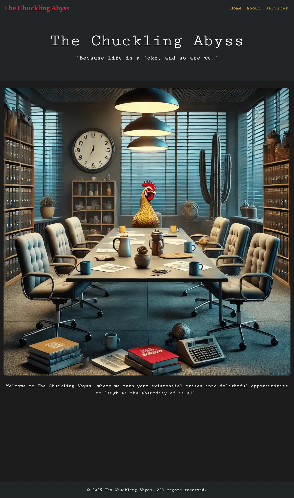
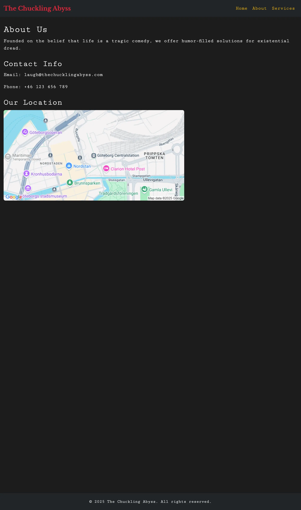
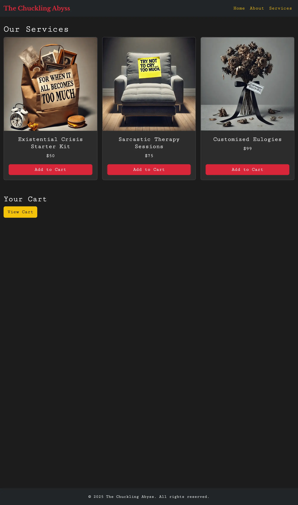

# The Chuckling Abyss

## Description

This repository features two versions of **The Chuckling Abyss** website, a fictional company offering delightfully dark
humor and existential services.

- `cloud24-webdev-lab1-web` is built using HTML, CSS, and JavaScript.
- `cloud24-webdev-lab1-react` is built using React and TypeScript.

[Live Demo](https://neurothrone.github.io/cloud24-webdev-lab1/)

## Images

